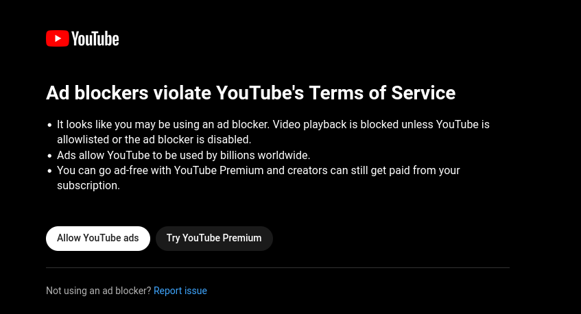

</img> 

# FYouToo - UNBLOCK YOUTUBE ADBLOCK-BLOCK

## Tired of this?

# Here is your solution! 

***<h2>For the Browser extension have a look at [browser-extension](./browser-extension/README.md)</h2>*** 

## What do you need to do?

- install [Pyhton3](https://www.python.org/downloads/): 
    - Linux: `sudo apt install python3.12` 
    - Windows: click [here](https://www.python.org/downloads/)
    - MacOS: click [here](https://www.python.org/downloads/)
- install [pyperclip](https://pypi.org/project/pyperclip/):
    - `pip install pyperclip`
- clone this repo: 
    - `git clone https://github.com/SchulerSimon/youfucktube.git`
- copy the URL of a youtube-video
    - `https://www.youtube.com/watch?v=dQw4w9WgXcQ`
- execute the script: 
    - `cd youfucktube`
    - CLI: 
      - Dose it once, needs to be executed each time you copy a youtube-url.
      - `python youfucktube.py`
    - GUI: 
      - Provides a Graphical User Interface you can interact with. 
      - `python youfucktubegui.py`
    - SERVICE:
      - Runs in the background. Just start the script once. And every time you copy a youtube-url, it should open a new window in the browser. 
      - `python youfucktubeforever.py`

## How dose it work?
Its super simple: *YouTube's AdBlock-Block only works on their website. When you embed a Video into another website, you can watch it just fine. This script basically automates that process.* 

- **copies** a youtube-link from your **clipboard**
- extracts the `video_id` from the link 
- creates a new link (like so `https://www.youtube-nocookie.com/embed/<video_id>`)
- calls the system-default browser to open this link and brings the browser to the front

## Things that could be improved:
- make this whole thing more accessible
  - make the script explain itself better via textoutput
  - build into standalone executable for major platforms
  - polish the GUI-Version a bit
- test MacOS, I cannot, have no mac. 
- make gui-version that runs as a service
- try multiple browsers, when `webbrowser.get().open(link)` fails
- en-/disable service script with hotkey(s)
- do some SEO, so that this repo is more easily found via google/bing/duckduckgo etc. 
- think of/design a logo

Any ideas, designs and PRs are welcome!

## Have your own idea? How to write extension for youfucktube?
- Have a look at this [example](extension_example_youfucktube.py). 

### Contributions: 
- Thanks to [MadaHaz](https://github.com/MadaHaz) there is also a Version with a GUI. 
- Thanks to the Idea of [granlem](https://github.com/granlem), there is also a Version that runs in the background like a service. 
- Thanks to [granlem](https://github.com/granlem), we now have a browser extension for major browsers that uses this concept and is easier to use. Look [here](./browser-extension/README.md)
- Thanks to [4robrob](https://github.com/4robrob), we now have a logo. 
